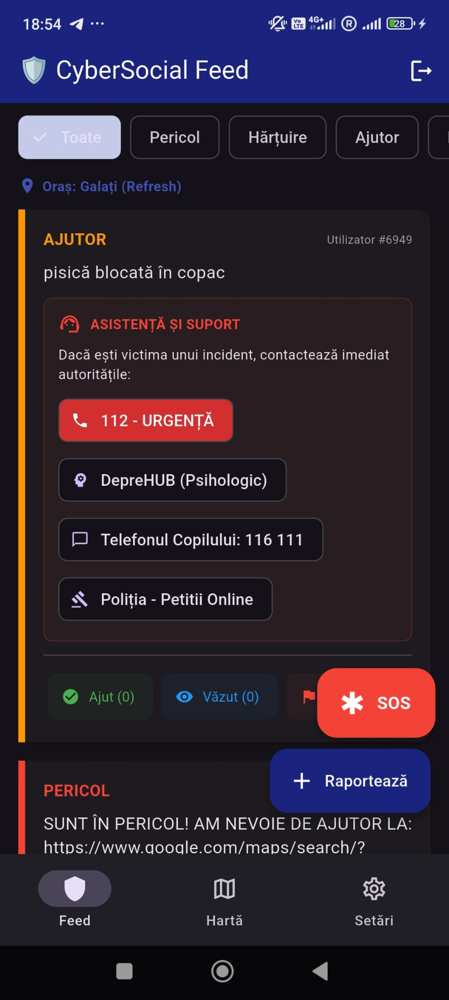
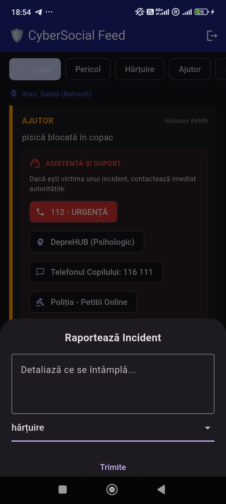
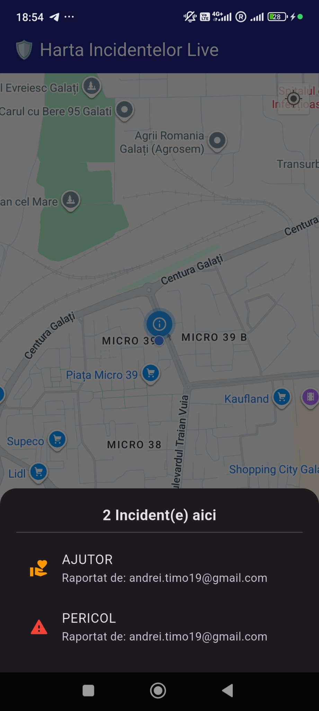
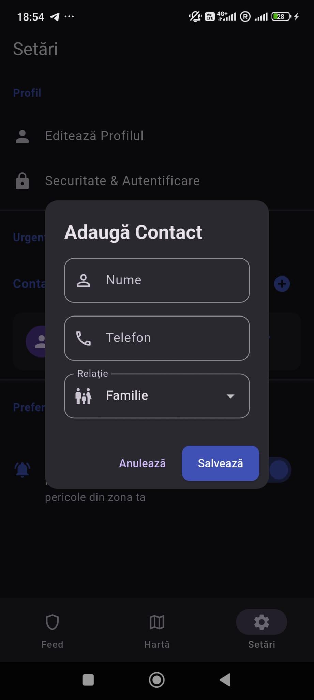
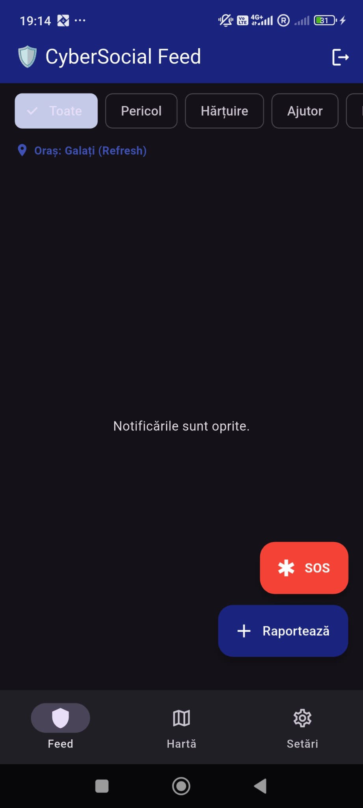
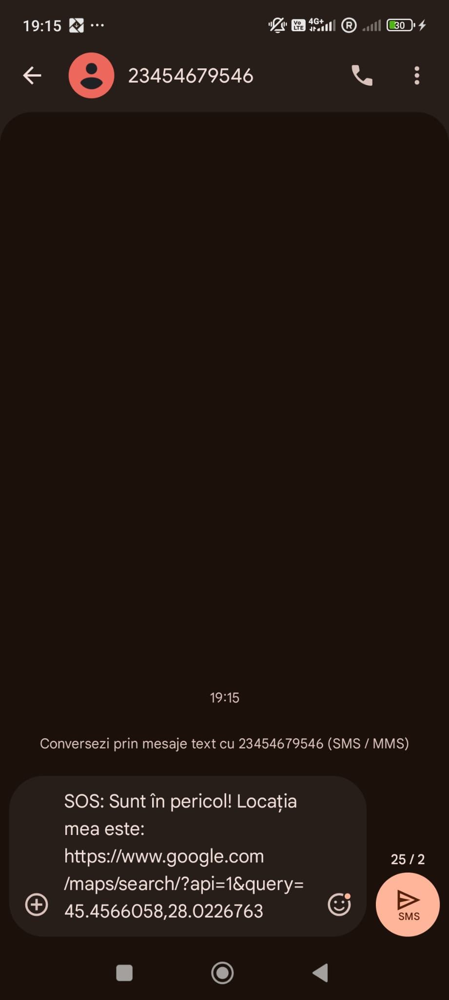

# CyberSocial - Community Safety App

CyberSocial is a mobile application developed with **Flutter**, designed to enhance community safety by enabling real-time incident reporting and quick management of emergency situations.

## 🚀 Key Features

* **Localized Feed:** Automatically displays incidents reported near the user based on their current GPS location.
* **Incident Map:** Interactive map interface for locating specific hazards or calls for help.
* **Simplified Reporting:** Intuitive system for reporting incidents (Danger, Harassment, Help).
* **Emergency Management:** Personal emergency contact management and quick access to essential support resources (112, DepreHUB, Police).
* **Secure Authentication:** Seamless and secure login integration with Google Firebase.

## 📸 App Preview

| Login | Feed | Report | Live Map | Contacts | Profile | Notifications | SOS SMS |
| :---: | :---: | :---: | :---: | :---: | :---: | :---: | :---: |
|  |  |  |  |  |  |  |  |

## 🎥 Demo

Check the aplication functionality below:


## 🛠 Technologies Used

* **Framework:** [Flutter](https://flutter.dev/) (Dart)
* **Backend & Auth:** [Firebase Cloud Firestore](https://firebase.google.com/docs/firestore), [Firebase Authentication](https://firebase.google.com/docs/auth)
* **Maps & Location:** Google Maps API, Geolocator
* **State Management:** Provider / Bloc

## ⚙️ How to run the project

1. **Clone this repository:**
   ```bash
   git clone [https://github.com/YOUR_USERNAME/CyberSocial-App.git](https://github.com/YOUR_USERNAME/CyberSocial-App.git)

2. **Install dependencies:**
   ```bash
   flutter pub get

3. **Configure Firebase:**
   *Ensure you have your google-services.json file in the android/app/ folder and that you have initialized Firebase via flutterfire configure.*

4. **Run the app:**
   ```bash
   flutter run

## 📝 License
This project is open-source and available for educational purposes.

